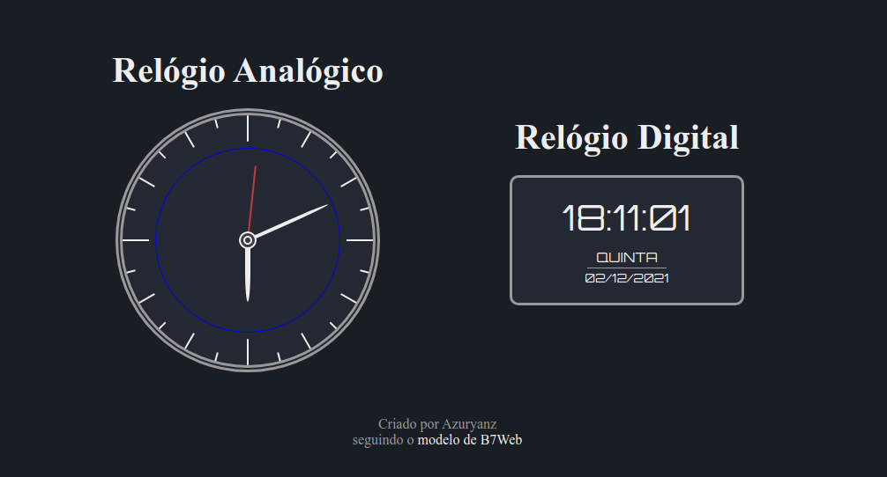

<h1 align="center">Relógios</h1>

## Sobre o Projeto
O projeto original é de autoria da B7Web, e a vídeo-aula mostrando como desenvolver o projeto base pode ser encontrada [aqui](https://alunos.b7web.com.br/curso/javascript/d7js-projeto-2-relogio).

Todo o **HTML**, **CSS** e **JavaScript** foi desenvolvido por conta própria, apenas visualizando o layout e ideias iniciais do projeto original.

As únicas diferenças relevantes entre o projeto desenvolvido e o da vídeo-aula são
- Elementos de personalização e disposição dos relógios;
- Estrutura dos códigos;

## Como utilizar

### Abrindo o arquivo
Uma vez que o projeto utiliza apenas de HTML, CSS e JavaScript, basta o usuário abrir o arquivo **index.html** em um navegador, que tela da bateria será carregada.

De resto, o projeto não demando nenhuma ação do usuário, atualizando os valores do relógio e as posições do ponteiro automaticamente, a cada *1 segundo*.

O termo **modelo de B7Web** é clicável, e redireciona para a vídeo-aula do projeto.
